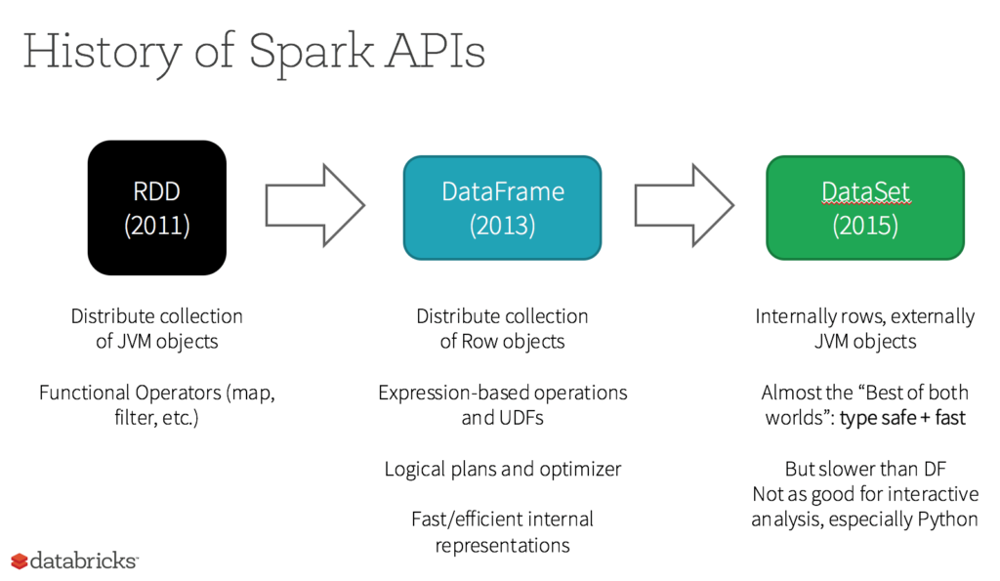

# SPARK

Apache Spark™ is a unified analytics engine for large-scale data processing.

## Getting Started with Spark

### Oficial Docs
* https://spark.apache.org/docs/latest/api/python/index.html

### Tutorials

* https://realpython.com/pyspark-intro/
* https://towardsdatascience.com/a-neanderthals-guide-to-apache-spark-in-python-9ef1f156d427
* https://changhsinlee.com/install-pyspark-windows-jupyter/ (older advice so will need new versions in the tutorial)
* https://medium.com/@loldja/installing-apache-spark-pyspark-the-missing-quick-start-guide-for-windows-ad81702ba62d

## Core concepts

### RDD 

* https://stackoverflow.com/questions/34433027/what-is-rdd-in-spark
* https://spark.apache.org/docs/latest/rdd-programming-guide.html#resilient-distributed-datasets-rdds

### Dataframe (different from Pandas Dataframe!!)

A DataFrame is a Dataset organized into named columns. It is conceptually equivalent to a table in a relational database or a data frame in R/Python, but with richer optimizations under the hood. 

### Transformations -> new DataFrame

* https://spark.apache.org/docs/latest/rdd-programming-guide.html#transformations

### Actions -> new data type(not DataFrame)

* https://spark.apache.org/docs/latest/rdd-programming-guide.html#actions

### Google Colab Notebook

* [Old Google Colab](http://colab.research.google.com/github/ValRCS/RCS_Data_Analysis_Python_2019_July/blob/master/PySpark/Neanderthal's_Guide_to_Apache_Spark_08_2019.ipynb)

