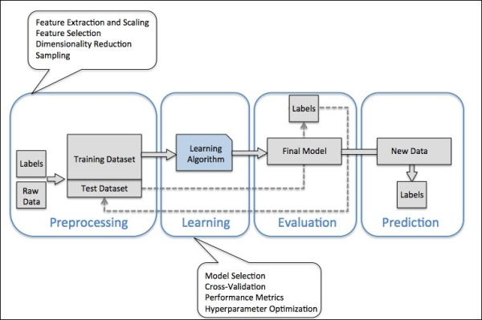
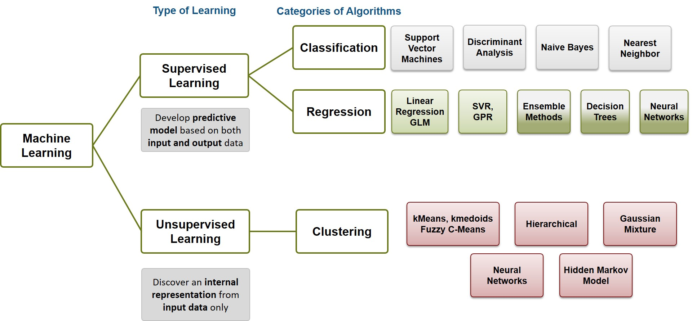

What is Machine Learning?

Machine learning is an artificial intelligence (AI) discipline geared toward the technological development of human knowledge. Machine learning allows computers to handle new situations via analysis, self-training, observation and experience.

Machine learning facilitates the continuous advancement of computing through exposure to new scenarios, testing and adaptation, while employing pattern and trend detection for improved decisions in subsequent (though not identical) situations.

Machine learning is often confused with data mining and knowledge discovery in databases (KDD), which share a similar methodology.

